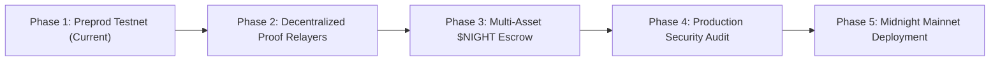

# ReliefShield — Product Proposal

> **Zero-Knowledge Transparent Disaster Relief & Shielded Aid Allocation Platform on the Midnight Network**

---

## What is the product, and who uses it?

### Product Overview
**ReliefShield** is a privacy-preserving, transparent disaster relief management and aid distribution platform built on the Midnight Network using Zero-Knowledge smart contracts written in **Compact**.

Traditional disaster relief platforms face a fundamental dilemma:
1. **Traditional Centralized Relief**: Lacks real-time auditability. Donors cannot verify if their funds reached genuine disaster victims or were siphoned off by administrative overhead.
2. **Transparent Blockchains (Ethereum / Bitcoin)**: Expose every donor's wallet address, net worth, complete transaction history, and disaster victim identities to public block explorers, creating severe safety and privacy risks.

**ReliefShield solves this dilemma by using Midnight's dual state model.** It combines 100% public ledger transparency for campaign fund allocation with complete Zero-Knowledge privacy for donors and aid recipients.

---

### Key User Groups

#### 1. Shielded Donors (Generous Public Contributors)
- **Goal**: Contribute funds ($tNIGHT) to emergency disaster campaigns (typhoons, earthquakes, floods).
- **Experience**: Connect Midnight Lace wallet and execute ZK circuits. Donors prove their contribution updated the public campaign pool in real-time **without disclosing their wallet address, personal identity, or net worth to on-chain observers**.

#### 2. Disaster Victims & Beneficiaries (Aid Recipients)
- **Goal**: Receive emergency supplies (shelter kits, food rations, medical packs) with dignity.
- **Experience**: Claim aid grants via local ZK proofs and present single-use **Aid QR Verification Handoff Tokens** to field coordinators without publishing their legal names or residential locations on a public blockchain.

#### 3. Field Relief Coordinators & Logistics Officers
- **Goal**: Verify disaster victims' eligibility and disburse aid supplies rapidly in logistics hubs.
- **Experience**: Use the **ReliefShield SaaS Admin Dashboard** to scan recipient QR tokens, track campaign milestones, and manage emergency logistics in under 5 seconds per claim.

#### 4. Public Auditors & Donors
- **Goal**: Ensure 100% cryptographic proof of fund integrity.
- **Experience**: Independently audit total accumulated campaign balances ($tNIGHT) on the Midnight Preprod block explorer, backed by zero-knowledge proofs.

---

## Why Midnight specifically?

Midnight is uniquely engineered for privacy-preserving smart contract applications, making it the ideal blockchain for **ReliefShield**:

### 1. Dual-State Architecture (Public vs. Private)
Midnight natively separates public ledger state from private contract witness data. Traditional smart contract languages (Solidity, Rust) require all state variables to be public. Midnight's **Compact** language allows ReliefShield to declare:
- **Public State**: `counterState` / `totalReliefPool` (auditable by anyone).
- **Private Witness Inputs**: `secretAmount` & donor wallet keys (evaluated locally inside browser memory).

### 2. Native In-Browser Local Prover
With Midnight.js and Compact runtime, zero-knowledge proofs are generated **locally on the user's client machine inside browser memory**. No sensitive donor or victim data is ever transmitted across the network to third-party RPC nodes or centralized servers.

### 3. Regulatory Alignment & Compliance
ReliefShield aligns with international data protection frameworks (GDPR, Data Privacy Acts) by ensuring zero Personally Identifiable Information (PII) is written to immutable public ledgers, while still providing complete mathematical proof of fund integrity.

---

## Data Model

The data model for ReliefShield categorizes state variables into **PUBLIC**, **PRIVATE**, and **PROVED-WITHOUT-REVEALED** claims enforced by our Compact smart contract:

| Category | Field / Variable Name | Data Type & Scope | Purpose & Privacy Guarantee |
| text | text | text | text |
| **PUBLIC** | `counterState` / `totalReliefPool` | `Uint<64>` (On-Chain Ledger State) | Transparent, real-time accumulated relief fund total auditable by the public. |
| **PUBLIC** | `proofVerificationStatus` | `Boolean` (On-Chain Event) | Mathematical confirmation that a valid ZK proof was verified by Midnight validators. |
| **PUBLIC** | `blockTimestamp` | `Uint<64>` (On-Chain Block Metadata) | Block creation timestamp recording when the relief contribution was settled on-chain. |
| **PRIVATE** | `secretAmount` | `Uint<64>` (In-Browser Witness Input) | The donor's raw contribution amount. Never written to the public ledger or network bytes. |
| **PRIVATE** | `donorWalletPrivateKey` | `Bytes<32>` (Client Local Storage) | Private key powering the donor's Midnight Lace wallet. Evaluated only in local memory. |
| **PRIVATE** | `recipientIdentitySecret` | `Bytes font-mono` (Client Witness Map) | Disaster victim identity token used to generate the QR verification handoff code. |
| **PROVED WITHOUT REVEALING** | `witnessValidityProof` | `ZK-SNARK Proof Payload` | Proves the user possesses a valid private witness input (`secretAmount > 0`), **without revealing their undisclosed input, wallet address, or net worth**. |
| **PROVED WITHOUT REVEALING** | `poolStateTransitionProof` | `State Circuit Constraint` | Proves that `newPoolBalance == previousPoolBalance + secretAmount` was computed correctly according to Compact circuit constraints. |

---

## Mainnet Feasibility Roadmap

To transition ReliefShield from the Midnight **Preprod Testnet** to production **Mainnet**, the following technical milestones will be implemented:

### 1. Multi-Asset & Tokenized Escrow Support
- Expand the Compact smart contract to support multi-asset tokens ($NIGHT, $ADA, stablecoins) and tokenized relief supply NFTs for track-and-trace logistics.

### 2. Decentralized Proof Server Relayer Network
- Deploy a decentralized cluster of Docker-based proof server relay nodes to optimize local proof generation times on lower-end mobile devices in remote disaster areas.

### 3. Hardware Wallet & Biometric Integration
- Integrate Midnight Lace hardware wallet support (Ledger / Trezor) and mobile WebAuthn biometric passkeys for field coordinators dishoarding emergency supplies.

### 4. Third-Party Formal Verification & Security Audit
- Conduct formal verification of the Compact smart contract constraints using automated prover toolchains to guarantee zero circuit leakage or reentrancy vectors prior to Mainnet launch.
