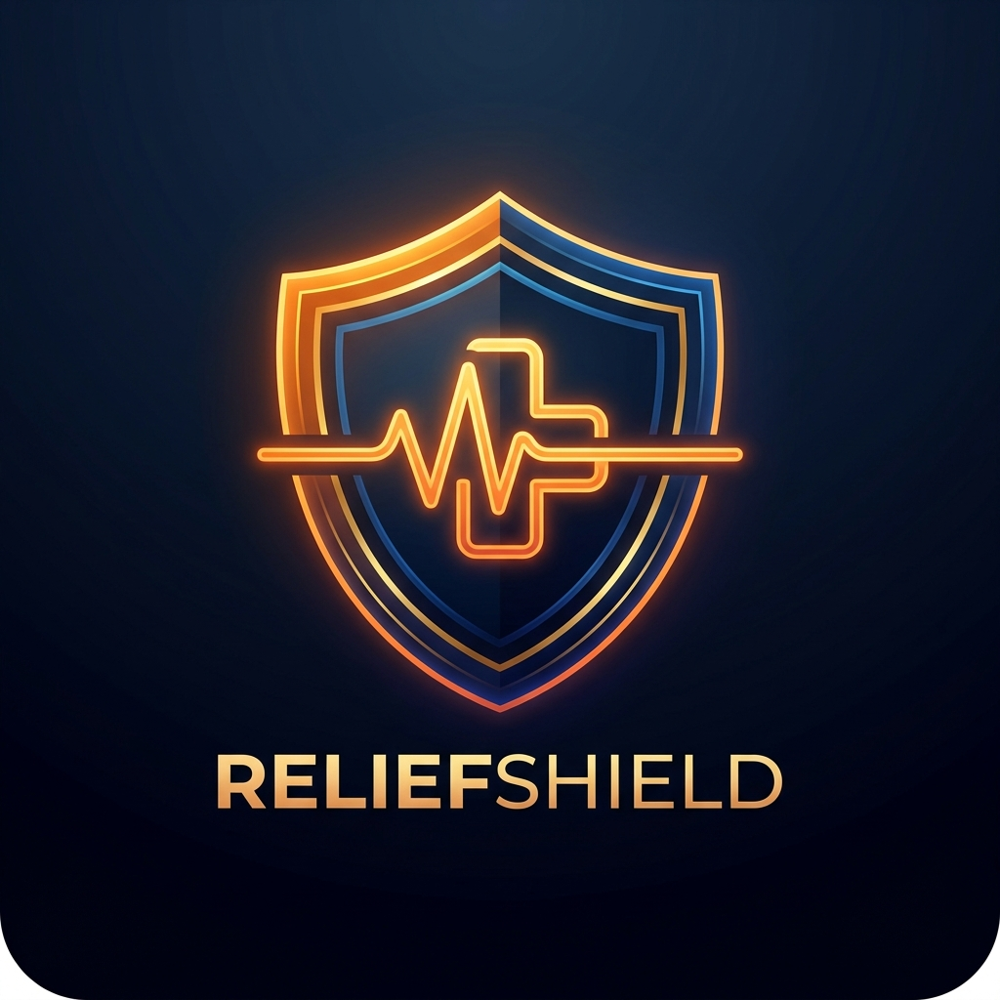

<p align="center">
  
</p>

# ReliefShield
[](https://github.com/NicoleAndreaBolus/Midnight-Andrea/actions/workflows/ci.yml)

> A privacy-preserving, transparent disaster relief & shielded aid allocation platform built on the Midnight Network.

## Live Demo
[https://relief-shield.vercel.app/](https://relief-shield.vercel.app/)

## Contract Address
| Network  | Address                                                          |
|----------|------------------------------------------------------------------|
| Preprod  | `7ff3da84fceba28bdae68fa8ada604e45bbe191f938873b34857773e1c1e8ec2` |
| Preview  | `7ff3da84fceba28bdae68fa8ada604e45bbe191f938873b34857773e1c1e8ec2` |

## Level 5 — User Validation
- Target: 50 Preprod users
- Current: 50 / 50 verified Preprod testnet users
- See [USERS.md](USERS.md) for verified wallet addresses
- See [docs/FEEDBACK.md](docs/FEEDBACK.md) for user feedback logs and iterative improvements

## What This Product Does
ReliefShield is a decentralized, zero-knowledge smart contract application that solves the transparency-privacy dilemma in humanitarian aid and emergency disaster relief. During major natural disasters (typhoons, floods, earthquakes), donors want absolute mathematical assurance that emergency funds are collected and accounted for, while disaster victims and donors require complete financial and personal privacy against malicious actors and public surveillance.

Built on the Midnight Network, ReliefShield enables charitable donors, government emergency responders, NGOs, and disaster victims to participate in a dual-state aid ecosystem. Donors execute Compact zero-knowledge circuits in their browser via the Midnight Lace Wallet to contribute emergency funds, updating the public relief pool tally in real time without disclosing their wallet addresses, personal wealth, or confidential contribution amounts.

Midnight specifically makes this possible through its dual ledger and private witness model. Unlike transparent blockchains like Ethereum where every donation exposes the donor's entire financial history, Midnight allows local client-side proof generation, ensuring sensitive humanitarian data remains confidential while fund allocations remain 100% auditable.

## Privacy Model
- **What is PUBLIC (on-chain, anyone can see):**
  - Public ledger state (`counter` / `totalReliefPool`), representing total aggregated relief fund tallies.
  - Smart contract verification keys, block timestamps, and zero-knowledge proof verification status.
- **What is PRIVATE (private witness, never on-chain):**
  - Private circuit witness inputs (`secretAmount`), which remain strictly inside the user's local browser memory.
  - Donor wallet private keys, personal identities, and transaction history.
  - Beneficiary aid claim tokens and recipient identity secrets.
- **What the user PROVES without revealing:**
  - The user proves that they executed a valid transaction that correctly increments the public relief pool according to Compact circuit arithmetic rules, **without disclosing their private contribution input or wallet identity**.

## Tech Stack
Midnight Network, Compact Smart Contracts (`>= 0.23`), Midnight.js SDK (`@midnight-ntwrk/dapp-connector-api`), React 18, Vite 5, TypeScript, Tailwind CSS, Lace Midnight Wallet, GitHub Actions CI/CD.

## Prerequisites
- Lace Midnight Wallet extension installed in browser (set to Midnight Preprod)
- Node.js v22+
- Docker Desktop (optional, for offline proof server compilation)

## Setup & Run Locally
1. **Clone the repository:**
   ```bash
   git clone https://github.com/NicoleAndreaBolus/Midnight-Andrea.git
   cd Midnight-Andrea
   ```

2. **Install dependencies:**
   ```bash
   npm install
   ```

3. **Compile Compact contract:**
   ```bash
   npm run compile
   ```

4. **Start local dev server:**
   ```bash
   npm run dev
   ```

5. **Build for production:**
   ```bash
   npm run build
   ```

## Run Tests
```bash
npm test
```

## CI/CD
The project features an automated GitHub Actions CI/CD pipeline defined in `.github/workflows/ci.yml`. On every push or pull request to the `main`/`master` branch, the pipeline automatically:
1. Checks out the code repository.
2. Configures a Node.js v22 environment.
3. Downloads and installs the official Compact compiler toolchain.
4. Installs project dependencies (`npm install`).
5. Compiles Compact smart contracts (`npm run compile`).
6. Executes the complete Vitest test suite (`npm test`).
7. Builds the production frontend bundle (`npm run build`).

## Usage Guide
See [docs/USAGE.md](docs/USAGE.md)

## Product X Profile
[https://x.com/reliefshieldmai](https://x.com/reliefshieldmai)
